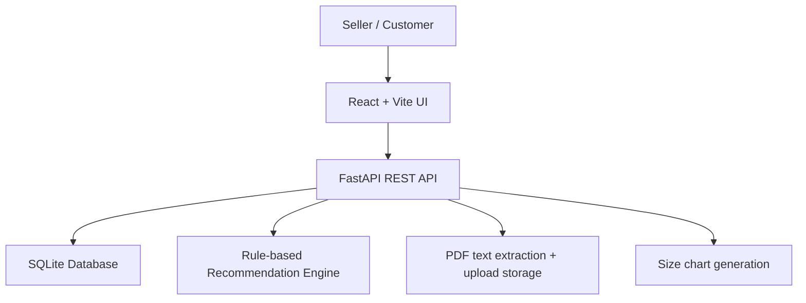

# Architecture

```mermaid
graph TD
    A[Seller / Customer] --> B[React + Vite UI]
    B --> C[FastAPI REST API]
    C --> D[SQLite Database]
    C --> E[Rule-based Recommendation Engine]
    C --> F[PDF text extraction + upload storage]
    C --> G[Size chart generation]
```

This slimmed-down MVP keeps the flow simple: sellers upload product details, the backend generates a size chart, and customers receive a recommended size based on measurements.
