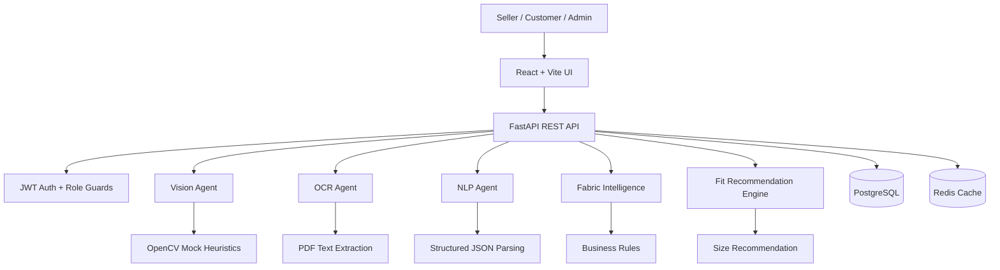

# Architecture

```mermaid
graph TD
    A[Seller / Customer / Admin] --> B[React + Vite UI]
    B --> C[FastAPI REST API]
    C --> D[JWT Auth + Role Guards]
    C --> E[Vision Agent]
    C --> F[OCR Agent]
    C --> G[NLP Agent]
    C --> H[Fabric Intelligence]
    C --> I[Fit Recommendation Engine]
    C --> J[(PostgreSQL)]
    C --> K[(Redis Cache)]
    E --> L[OpenCV Mock Heuristics]
    F --> M[PDF Text Extraction]
    G --> N[Structured JSON Parsing]
    H --> O[Business Rules]
    I --> P[Size Recommendation]
```

The flow is intentionally layered so the seller upload pipeline can evolve independently from the recommendation endpoint.
