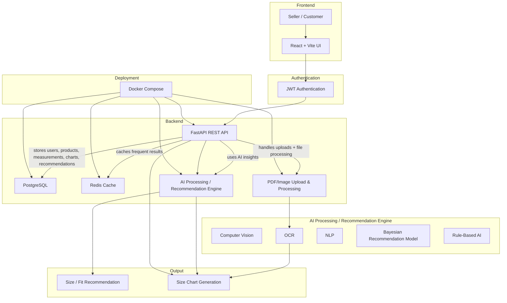

# Architecture

This architecture shows:

- Frontend: Seller / Customer access via a React + Vite UI.
- Authentication: JWT Authentication between the frontend and FastAPI backend.
- Backend: FastAPI REST API as the central service.
- Database: PostgreSQL storing users, measurements, seller/product data, size charts, and recommendation-related data.
- Cache: Redis Cache connected to FastAPI for frequently accessed data and results.
- AI Processing Layer: Computer Vision, OCR, NLP, Bayesian Recommendation Model, and Rule-Based AI.
- File / Upload Processing: PDF/Image upload and text extraction connected to OCR and the backend.
- Size Chart Generation: linked to OCR/AI processing and FastAPI.
- Deployment: Docker Compose orchestrating FastAPI, PostgreSQL, Redis, and AI services.
